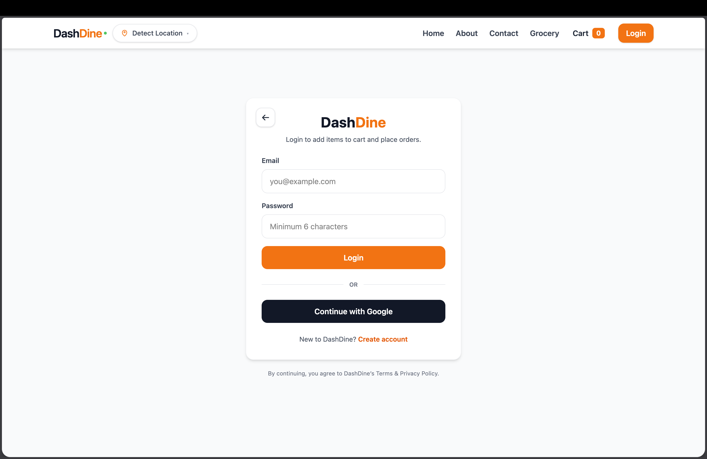
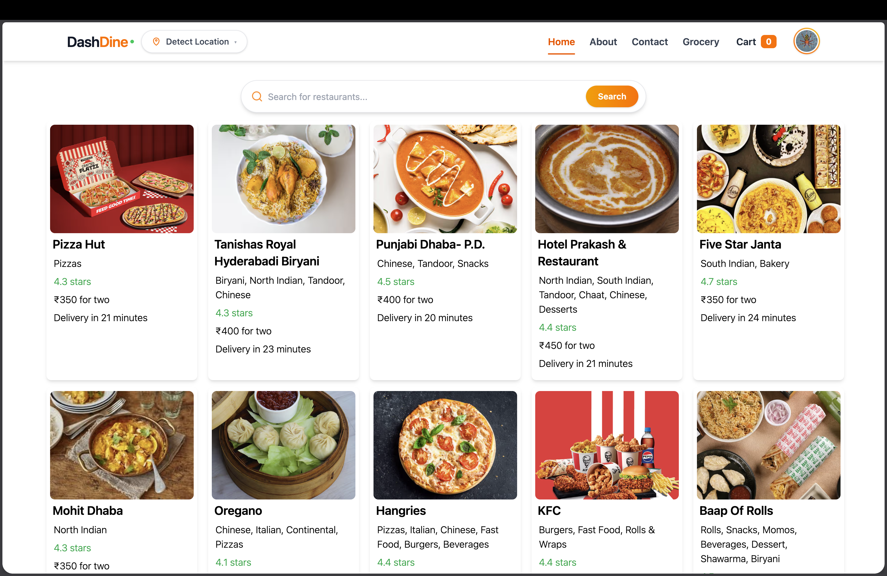
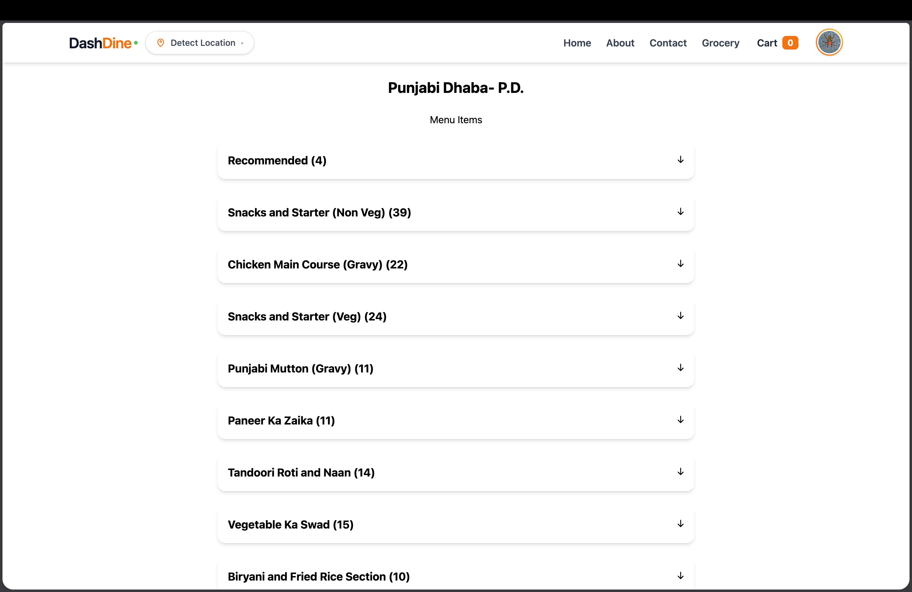
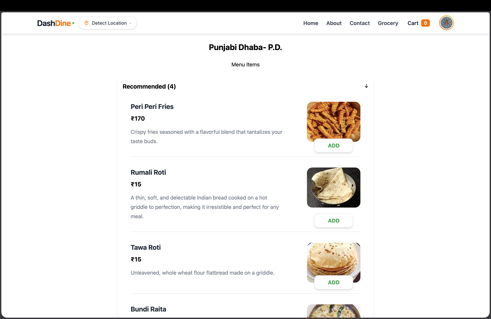
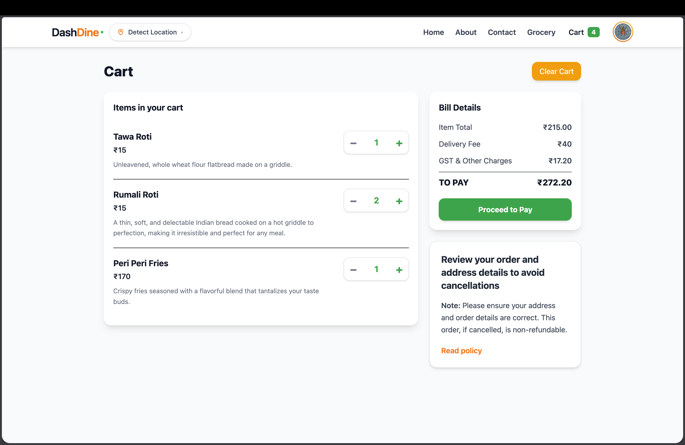
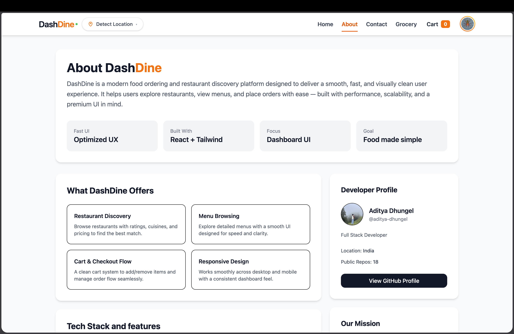
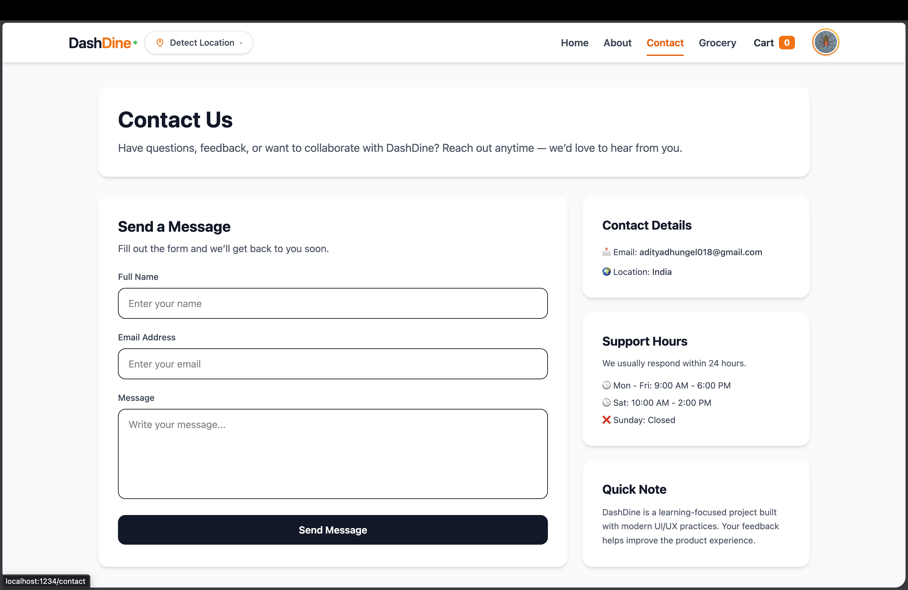

DashDine

An AI-powered food ordering platform built with JavaScript that combines a Swiggy-like UI with real-time restaurant data and seamless cart management.

Overview

DashDine is a modern web application developed using React (JavaScript) that allows users to browse restaurants, explore menu items fetched from the Swiggy API, and manage their cart efficiently.
It integrates Firebase Authentication, Redux Toolkit, and Swiggy API data to deliver a personalized and interactive food ordering experience.

This project demonstrates real-world frontend architecture, API integration, authentication, and state-driven features using modern JavaScript practices.

Features

User authentication using Firebase (Login / Signup)

Browse restaurants dynamically

Fetch live restaurant menus using Swiggy API

Add and manage cart items using Redux Toolkit

Shimmer loading effects for improved user experience

Modern UI built with React and Tailwind CSS

Global state management using Redux Toolkit

Fast, responsive, and scalable JavaScript-based frontend

## Screenshots

### Authentication

### Home

### Menu List

### Menu Items

### Cart

### About

### Contact

Tech Stack

Language: JavaScript (ES6+)

Frontend: React, Tailwind CSS

State Management: Redux Toolkit

Authentication: Firebase Auth

APIs: Swiggy API

Build Tool: Parcel

Note

Some API features (such as Swiggy API access) may be affected by CORS restrictions or regional availability.
